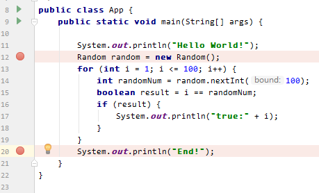
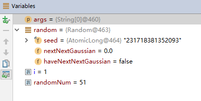
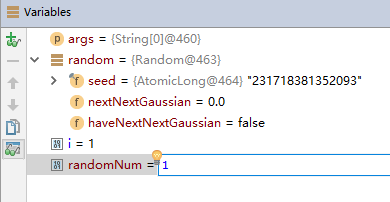
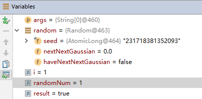
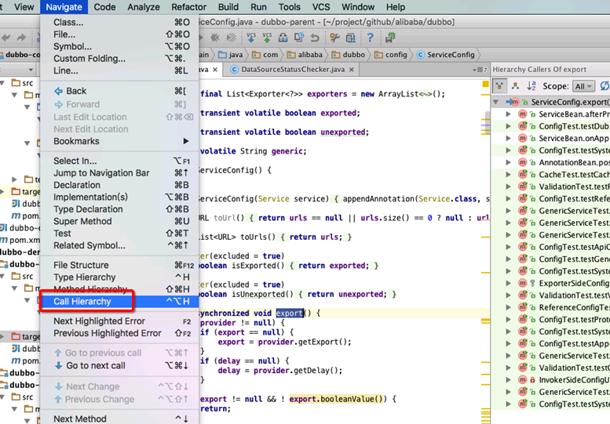
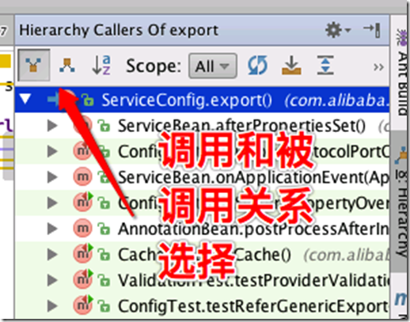
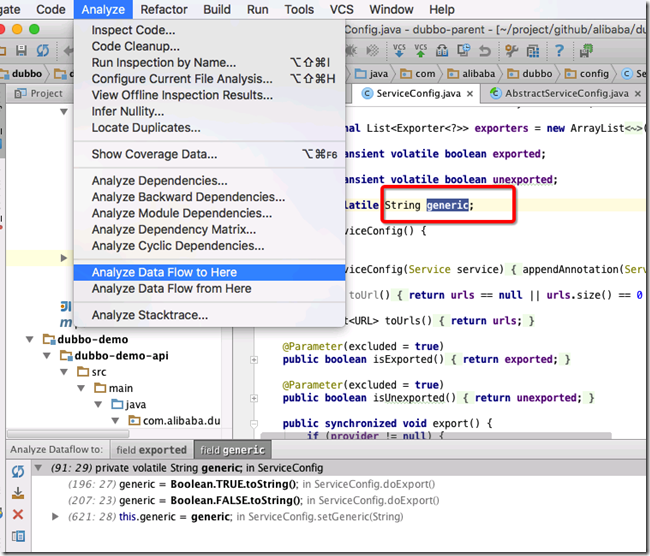
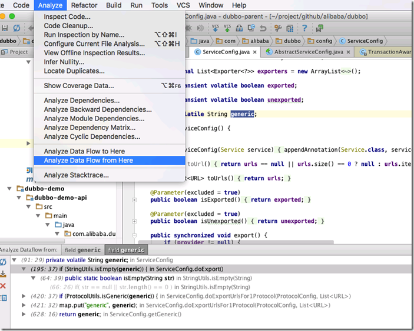
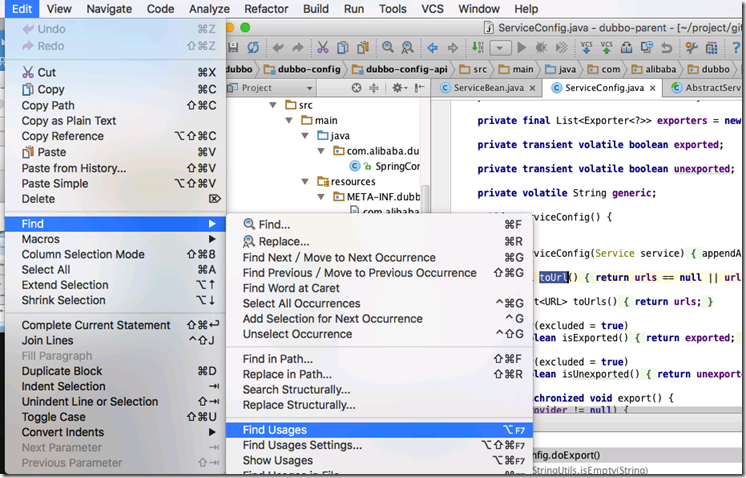
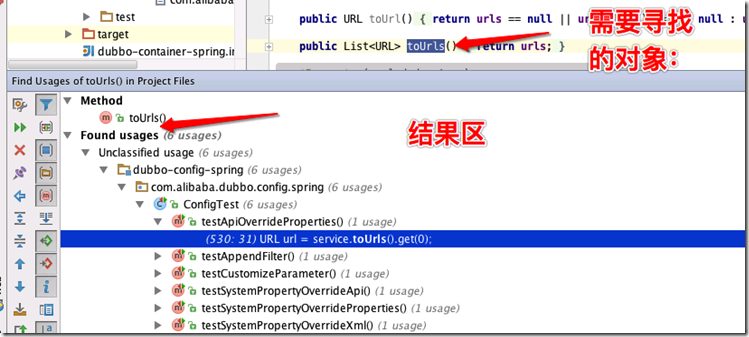

# Intellij调试

##1.基本功能
- 设置断点

在代码编辑区域，点击左侧代码行行号的边，即可在该行设置断点



- 启动调试

鼠标右键菜单->Run App.main()，或者使用快捷键Shift+F9启动调试


启动调试后，程序启动，并会停留在第一个断点这一行。且这行的代码并未执行。
IDEA的底部会出现Debug工作区。所有按钮鼠标移动上去都有tips。

##2.组件介绍
###1.常用工具栏

| 按钮     | 说明&快捷键                    |
| ------ | ------------------------- |
| 绿色返回箭头 | 重新运行程序（Ctrl+F5）           |
| 绿色向右箭头 | 继续执行程序，如果遇到断点则会停留到该断点（F9） |
| 红色方块   | 停止程序（Ctrl+F2）             |
| 双红色小圆圈 | 查看所有断点信息（Ctrl+Shift+F8）   |

###2.Debug工具栏

| 按钮          | 说明&快捷键                                   |
| ----------- | ---------------------------------------- |
| 红色箭头+横线     | **回到当前待执行，调试过程中如果查看引用的方法跳来跳去，可以使用该功能快捷返回**。（Alt+F10） |
| 蓝色向下箭头      | 单步调试：执行一条语句，但是遇到方法调用时不进入，直到方法执行完成后直接继续。（**即如果当前行有方法调用，这个方法将被执行完毕返回，然后到下一行**）（F8） |
| 蓝色向右下箭头     | 单步调试：执行一条语句，但是遇到系统类库方法调用时不进入，直到方法执行完成后直接继续。如果遇到非系统类库中的方法，则会进入该方法进行调试。（**即如果该行有自定义方法，则运行进入自定义方法（不会进入官方类库的方法**）（F7） |
| 红色向右下箭头     | 单步调试：执行一条语句，遇到方法调用时会进入方法进行调试（Alt+Shift+F7） |
| 蓝色向右上箭头     | 执行当前当前方法并到下一步骤（**如果在调试的时候你进入了一个方法，并觉得该方法没有问题，你就可以使用stepout跳出该方法，返回到该方法被调用处的下一行语句。值得注意的是，该方法已执行完毕**），如果当前方法有断点则会到下一个断点。（Shift+F8） |
| 蓝色向右下小箭头+竖线 | 运行到下一个断点（Alt+F9）                         |

###3.Frames区域
该区域主要显示当前的堆栈信息

| 项                 | 说明           |
| ----------------- | ------------ |
| mian:12           | mian方法的第12行  |
| App               | 当前的类名        |
| io.ken.hello.java | package name |

###4.变量区域
管理当前方法已经声明的变量信息



修改变量值

选中要修改变量，使用快捷键F2进入编辑模式



回车键保存，然后F8进行单步调试



这样，本来运行后result=false，结果由于我们修改了变量的值。让本来会被跳过的if语句块可以被调试。

##3.调用树

- IntelliJ IDEA中可以在主菜单中选择Navigate | Call Hierarchy命令查看一个Java方法调用树（caller和callee两个方向）。

  

  如下图，左上角的两个按钮是调用和被调用关系的显示。

  

- IntelliJ IDEA中可以在主菜单中选择Analyze | Dataflow from/to Here两个命令查看表达式、变量和方法参数的传递关系树。

  Analyze | Data Flow  to Here

  

  Analyze | Data Flow  from Here

  

- IntelliJ IDEA的"Find Usage"可以查看一个Java类、方法或变量的直接使用情况。 
  
    

##4.IDEA调试快捷键总结

| 快捷键           | 说明                                       |
| ------------- | ---------------------------------------- |
| Shift+F9      | 启动调试                                     |
| F9            | 继续执行程序，如果遇到断点则会停留到该断点                    |
| Ctrl+F2       | 停止程序                                     |
| Ctrl+Shift+F8 | 查看所有断点                                   |
| Alt+F10       | 回到当前待执行，调试过程中如果查看引用的方法跳来跳去，可以使用该功能快捷返回   |
| F8            | 单步调试：执行一条语句，但是遇到方法调用时不进入，直到方法执行完成后直接继续。  |
| F7            | 单步调试：执行一条语句，但是遇到系统类库方法调用时不进入，直到方法执行完成后直接继续。如果遇到非系统类库中的方法，则会进入该方法进行调试 |
| Alt+Shift+F7  | 单步调试：执行一条语句，遇到方法调用时会进入方法进行调试             |
| Shift+F8      | 执行当前当前方法并到下一步骤，如果当前方法有断点则会到下一个断点         |
| Alt+F9        | 运行到下一个断点                                 |

##5.查看该类中所有函数
点击Navigate | File Structure

##6.项目内查找
输入快捷键：CTRL+SHIFT+F

##7.Intellij中生成类注释和方法注释

###类注释
File - Settings - Editor - File and Code Templates

在右侧的Includes中点击添加符号，输入名称：File Header，输入下面的内容。

```
/**
*
* author: jomei
* date: ${DATE} ${TIME}
*/
```

###方法注释
File - Settings - Editor - Live Templates

在右侧先点击加号，添加一个Template Group, 然后选中这个Template Group，再点击加号，添加Live Template。

在Abbreviation中添加快捷键：a

在Description中添加注释

在文本框中输入下面内容

然后点击Edit variables，在Expression中分别选中：methodParameters, methodReturnType, Date()

最后调用时，**直接输入/ + 你设置的Abbreviation快捷键 + tab键就直接生成了 （我设置的是/+ a + tab）**

注意下面最上面是不用/的。

```
** 
* @Description: $description$ 
* @Param: $params$ 
* @return: $returns$ 
* @Author: jomei
* @Date: $date$ 
*/ 
```


##Reference
https://ken.io/note/java-quickstart-idea-debug-skill 讲述intellij的各个选项的含义

http://www.cnblogs.com/Bowu/p/4026117.html 讲述各个方法意义，补充了一些细节

https://github.com/judasn/IntelliJ-IDEA-Tutorial/blob/master/debug-introduce.md 官网翻译

http://www.cnblogs.com/ghj1976/p/5382455.html 讲解部分操作

https://blog.csdn.net/qq_34581118/article/details/78409782 讲解生成注释的方法
